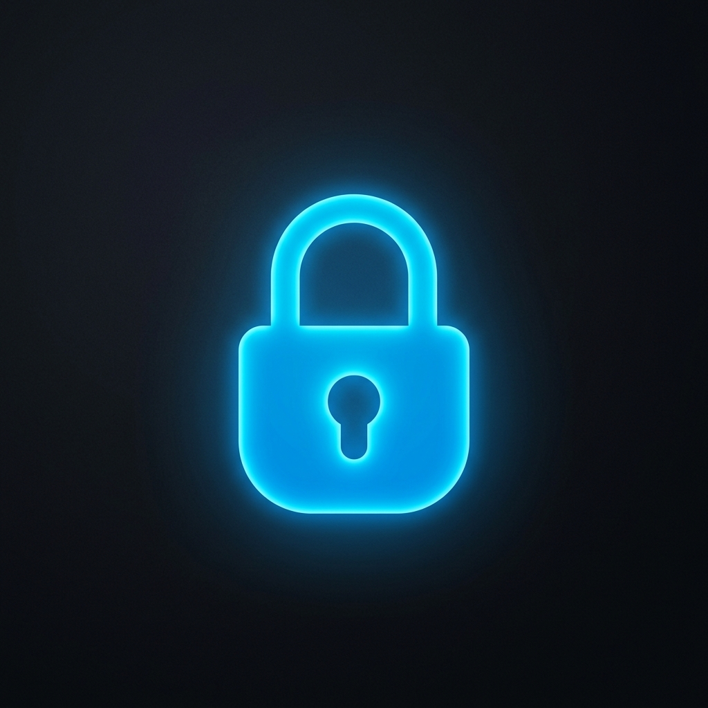

<div align="center">
  
  <h1>LockMate 🔐</h1>
  <p><strong>A secure, modern, locally-hosted password manager built with Python and CustomTkinter.</strong></p>

  <!-- Badges -->
  <a href="https://www.python.org/"></a>
  <a href="https://www.sqlite.org/"></a>
  <a href="https://github.com/lockmate/lockmate/blob/main/LICENSE"></a>
  <a href="#"></a>
</div>

---

## 📖 Table of Contents

- [Introduction](#-introduction)
- [Features](#-features)
- [Technologies](#-technologies)
- [Architecture](#-architecture)
- [Security Highlights](#-security-highlights)
- [Screenshots](#-screenshots)
- [Installation](#-installation)
- [Usage](#-usage)
- [Folder Structure](#-folder-structure)
- [Roadmap](#-roadmap)
- [License](#-license)
- [Author](#-author)

---

## 🚀 Introduction

**LockMate** is a locally-hosted, zero-knowledge password manager designed for users who want total control over their personal data without relying on cloud-based subscriptions. It provides a sleek, modern desktop interface powered by CustomTkinter while maintaining military-grade encryption under the hood.

---

## ✨ Features

| Feature | Description |
|---------|-------------|
| **Local Encryption** | AES-128 GCM (Fernet) encryption guarantees your data never leaves your machine. |
| **Password Generator** | Built-in secure generator with customizable length, symbols, cases, and numbers. |
| **Vault Management** | Search, filter, categorize, and favorite your stored credentials instantly. |
| **1-Click Copy** | Instantly copy your usernames or passwords without permanent exposure. |
| **Show/Hide Reveal** | Granular masking toggles to protect your screen from wandering eyes. |
| **Dashboard Statistics** | Quick visual telemetry of total, favorite, weak, and strong passwords. |
| **Security Metrics** | Live dashboard strength indicators and interactive password expiry reminders. |
| **Import & Export** | Secure database backup/restore mechanics, plus plaintext CSV/JSON exporting. |
| **Auto-Locking** | Configurable session timeouts and a manual "Lock Vault Now" panic switch. |
| **Theming** | Native Light, Dark, and System appearance modes for all lighting environments. |
| **About Dialog** | Quick access to your runtime configuration and system architecture states. |

---

## 🛠 Technologies

- **Language:** Python 3.10+
- **GUI Framework:** CustomTkinter (built on Tkinter)
- **Database:** SQLite3
- **Encryption Engine:** Cryptography (Fernet)
- **Hashing:** bcrypt

---

## 🏗 Architecture

LockMate employs a strict 3-tier architecture to ensure logic separation and long-term maintainability:

1. **Presentation Layer (`app/ui/`)**: Handles all visual components, screen routing, theme injection, and user interactions.
2. **Business Logic Layer (`app/core/`)**: Processes analytical health metrics, password generation, backup routines, and vault filtering.
3. **Data Access Layer (`app/data/`)**: Acts as the sole barrier interacting with the SQLite engine and handles real-time database schema migrations natively.

---

## 🛡 Security Highlights

* **Zero-Knowledge Architecture:** The master password is never stored anywhere in the database.
* **Salted Hashing:** User authentication relies on heavily salted `bcrypt` algorithms.
* **Symmetric Encryption:** Vault items are encrypted dynamically using a key securely derived at runtime via `PBKDF2HMAC`.
* **Clipboard Sanitization:** Memory buffers are cleared natively on session lock.

---

## 📸 Screenshots

> *Example UI configurations are displayed below.*

<div align="center">
  
  
  <br>
  
  
</div>

---

## ⚙️ Installation

1. **Clone the repository:**
   ```bash
   git clone https://github.com/lockmate/lockmate.git
   cd lockmate
   ```

2. **Create a virtual environment (optional but recommended):**
   ```bash
   python -m venv venv
   source venv/bin/activate  # On Windows use: venv\Scripts\activate
   ```

3. **Install dependencies:**
   ```bash
   pip install -r requirements.txt
   ```

4. **Initialize the database and run:**
   ```bash
   python main.py
   ```

---

## 🕹 Usage

1. Launch the application via `python main.py`.
2. Register a new user profile with a strong Master Password.
3. Your vault will automatically initialize on disk at `data/lockmate.db`.
4. Add new vault items, securely generate passwords, and categorize your credentials safely.
5. Setup automated lock timeouts in the Settings panel for optimal safety.

---

## 📂 Folder Structure

```text
LockMate/
│
├── app/
│   ├── core/           # Business logic, generators, and vault handlers
│   ├── data/           # SQLite models, repositories, and migrations
│   ├── security/       # AES Encryption logic and Auth mechanics
│   ├── ui/             # CustomTkinter GUI components and screens
│   └── utils/          # Universal helpers (logging, formatting)
│
├── assets/             # Static files (images, icons, fonts)
├── data/               # Local persistence (lockmate.db)
├── logs/               # Local runtime event logs
│
├── config.py           # Global constants and environmental settings
├── main.py             # Application entry point
├── requirements.txt    # Python dependencies
└── README.md           # You are here!
```

---

## 🛣 Roadmap

- [ ] Multi-user concurrent support
- [ ] Browser extension bridging API
- [ ] 2FA (Two-Factor Authentication) implementation
- [ ] Pwned Passwords API integration
- [ ] Secure file/attachment storage

---

## 📜 License

This project is licensed under the MIT License - see the [LICENSE](LICENSE) file for details.

---

## 👨‍💻 Author

**LockMate Team**  
*Building secure, offline-first utilities for everyone.*
